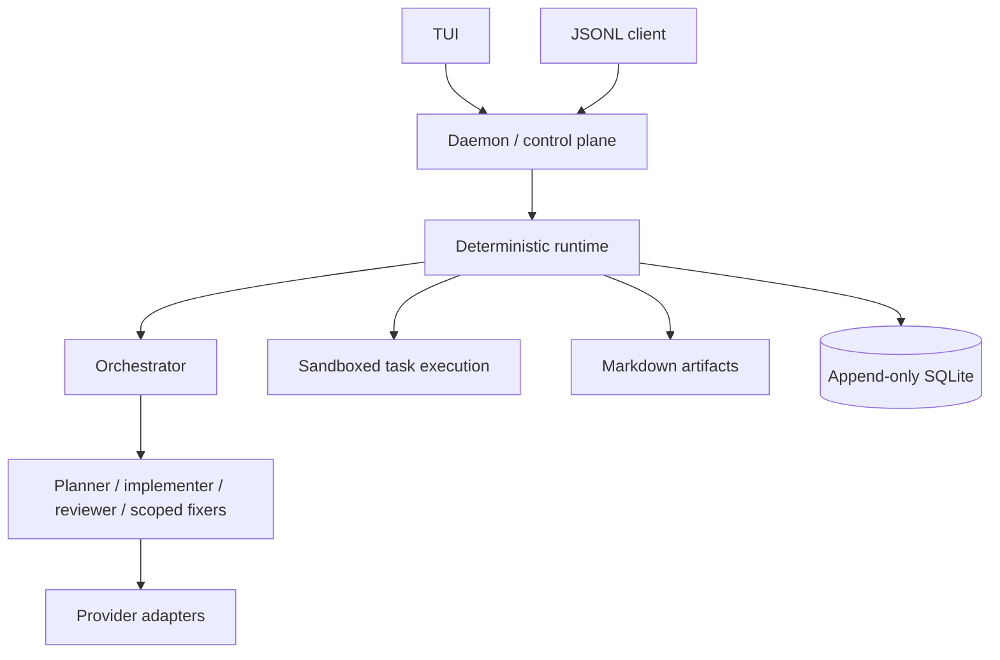

# Architecture

Akashic separates proposal from authority. Providers produce proposals and observations; the deterministic Rust runtime validates transitions, records evidence, enforces policy, schedules work, and owns approvals and invariants. This is explanatory; normative behavior is in `openspec/`. See the [accepted-decision index](product-requirements.md) and [implementation plan](implementation-plan.md).

The daemon is the authority for the task integration worktree and Git integration. Writers use logical child writer worktrees as sibling directories; integration produces ephemeral commits under daemon control. Clients do not mutate authoritative state directly.

Execution is native Linux through bubblewrap, Landlock, seccomp, private task home/environment, and limits. Security levels are explicit; denied capabilities do not silently fall back. Docker, network, display, SSH, and D-Bus are denied by default.

Graphify is initially a code-only adapter. The source remains authoritative while a graph may improve navigation. Optional LSP integration and context optimization are bounded evaluation lanes. See [invariants](invariants.md), [threat model](threat-model.md), and the [ADRs](adr/0001-deterministic-control-plane.md).
