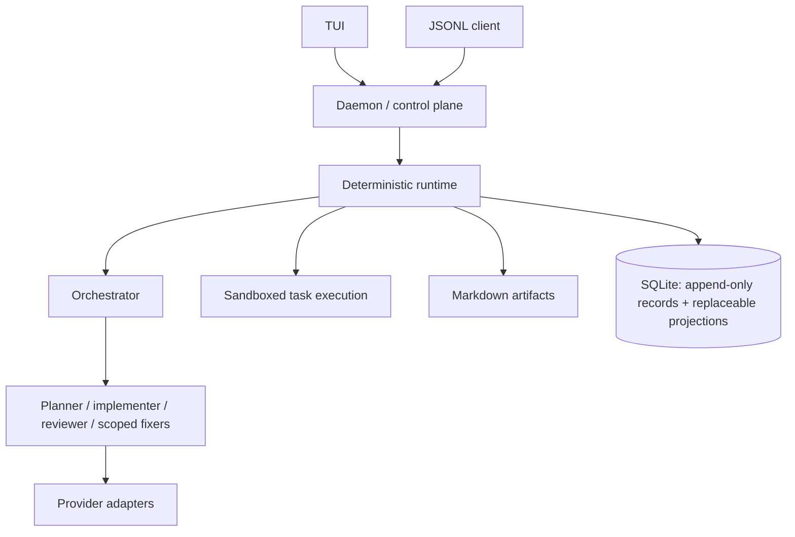

# Architecture

Akashic separates proposal from authority. Providers produce proposals and observations; the deterministic Rust runtime validates transitions, records evidence, enforces policy, schedules work, and owns approvals and invariants. This is explanatory; normative behavior is in `openspec/`. See the [accepted-decision index](product-requirements.md) and [implementation plan](implementation-plan.md).



The daemon is the authority for the task integration worktree and Git integration. Writers use logical child writer worktrees as sibling directories; integration produces ephemeral commits under daemon control. Clients do not mutate authoritative state directly.

Execution is native Linux through bubblewrap, Landlock, seccomp, private task home/environment, and limits. Security levels are explicit; denied capabilities do not silently fall back. Docker, network, display, SSH, and D-Bus are denied by default.

Graphify is initially a code-only adapter. The source remains authoritative while a graph may improve navigation. Optional LSP integration and context optimization are bounded evaluation lanes. See [invariants](invariants.md), [threat model](threat-model.md), and the [ADRs](adr/0001-deterministic-control-plane.md).

## Source architecture

The intended source shape is a single-package modular monolith, not an
additional crate boundary:

```text
src/main.rs (composition)  src/lib.rs (crate/test boundary)
src/artifacts/{mod,store,schema,lineage,replay,recovery}.rs
src/{config,runtime,json,shutdown}.rs
```

This is a target organization; the artifact modules are not yet claimed to be
fully extracted. Until the approved Slice 4 checkpoint, its implementation may
remain in the existing artifact module. Thereafter, extraction is mechanical
and behavior-preserving. Dependencies point from composition and narrow
facades toward capability owners, never from capabilities into `main` or CLI
protocol code. The artifacts facade stays narrow and `Store` remains concrete.

See [ADR 0010](adr/0010-modular-monolith-and-dependency-direction.md) as the
authority for this source-boundary decision. `schema.rs` owns DDL, migrations,
and physical schema validation. `store.rs` owns connection lifecycle and
transactions and invokes schema operations; capability-owned transactional
statements may remain with their capability, but no direct schema mutation
occurs outside `schema.rs`. Append-only source events and history
are authoritative; replay and other projections are replaceable derived state.
