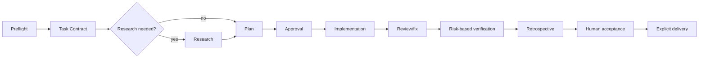

# Product requirements

## Status and boundary

This is the explanatory accepted-decision index for a pre-implementation project. Normative requirements, scenarios, and acceptance criteria belong in `openspec/`; this document and linked decisions must not substitute for those specs. See the [implementation plan](implementation-plan.md), [lifecycle](lifecycle-and-outcomes.md), [artifacts and replay](artifacts-and-replay.md), [sandboxing](sandboxing.md), [credentials](credentials-and-routing.md), [privacy](privacy-and-retention.md), [knowledge governance](knowledge-governance.md), and [qualification matrix](qualification-matrix.md).

## Product

Akashic is an Apache-2.0, local-first Rust AI coding harness for Linux, WSL2, and headless Linux. It is one harness executable used through separate daemon, TUI, and JSONL processes. The deterministic runtime is authoritative; an LLM orchestrator proposes strategy only.

The fixed core is orchestrator, planner, implementer, and reviewer. Scoped fresh fixers may be created for bounded problems. Dynamic helpers are available only through the orchestrator.

## Task lifecycle

Every task has a task integration worktree. Logical child writer worktrees are sibling directories; the daemon owns Git integration and ephemeral commits.

## Records and trust

Canonical authored artifacts are Markdown. SQLite is append-only for events, projections, findings, evidence, history, and replay. Current files and runtime records have explicit ownership. Raw task history is retained locally until explicit deletion.

Terminal outcomes are `verified`, `accepted_with_waivers`, `accepted_partial`, `blocked`, `aborted`, and `failed`. Exact event playback is distinct from captured-outcome simulation.

## Providers and extensibility

Targets are OpenAI, Anthropic, Gemini, OpenRouter, and OpenAI-compatible local providers. Only official API/service/workload credentials are allowed. Graphify starts as a code-only adapter with a soft graph-first/source-authoritative model; LSP is optional. Headroom is evaluation-only and is ported only if evidence supports it.

Memory is bounded and curated with FTS. Every task receives a full retrospective. Learning follows propose → evaluate → approve → activate → rollback. Routing starts static and transparent; adaptive proposals come later. Agent Skills compatibility, MCP, and declarative customization are intended; v1 has no public executable plugin ABI.

## Platform and privacy

Rust, Java, and Kotlin Multiplatform are reference ecosystems. Apple targets are explicitly unverified from Linux. OS filesystem protection is the initial privacy boundary and telemetry is opt-in.
