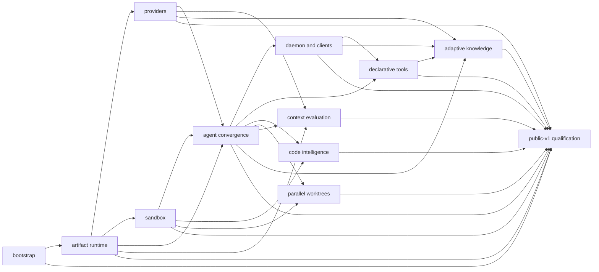

# Roadmap

This sequencing is explanatory; each change requires an approved OpenSpec change. See the [through-v1 implementation plan](implementation-plan.md).

| ID | Direct dependencies | Deliverable boundary | Non-goal | Acceptance boundary |
|---|---|---|---|---|
| `bootstrap-rust-harness` | none | Rust workspace and executable baseline | no product behavior | reproducible build |
| `build-artifact-runtime` | bootstrap-rust-harness | owned Markdown/SQLite events and replay | no providers | event, projection, migration evidence |
| `add-provider-runtime` | build-artifact-runtime | normalized allowlisted providers | no CLI-token import | credential/redaction evidence |
| `secure-worktree-execution` | build-artifact-runtime | daemon-owned task integration worktree and native profiles | no silent fallback | capability denial and recovery evidence |
| `implement-agent-convergence` | build-artifact-runtime + add-provider-runtime + secure-worktree-execution | fixed core and lifecycle | no unrestricted dynamic agents | review and gate evidence |
| `expose-daemon-and-clients` | implement-agent-convergence | daemon, TUI, JSONL processes | no alternate authority | protocol/crash evidence |
| `add-declarative-tools` | implement-agent-convergence + expose-daemon-and-clients | Agent Skills/MCP/declarative integrations | no executable plugin ABI | bounded loading evidence |
| `integrate-code-intelligence` | secure-worktree-execution + implement-agent-convergence | Graphify code adapter, optional LSP | no source replacement | source-authority evidence |
| `add-parallel-worktree-execution` | secure-worktree-execution + implement-agent-convergence | bounded sibling writers | no daemon bypass | conflict/integration evidence |
| `evaluate-context-optimization` | build-artifact-runtime + add-provider-runtime + implement-agent-convergence | Headroom evaluation lane | no unproved port | comparative evidence and approval |
| `add-adaptive-knowledge` | add-provider-runtime + implement-agent-convergence + expose-daemon-and-clients + add-declarative-tools | governed bounded memory/router proposals | no silent learning | rollback and lineage evidence |
| `qualify-public-v1` | every completed predecessor | release qualification | no Apple claim from Linux | matrix, security, privacy, acceptance gates |

| Baseline | Traced decision documents | OpenSpec owner(s) | Qualification gate |
|---|---|---|---|
| deterministic control plane | [ADR 0001](adr/0001-deterministic-control-plane.md), [lifecycle](lifecycle-and-outcomes.md) | lifecycle/runtime changes | `qualify-public-v1` |
| authored artifacts and replay | [ADR 0002](adr/0002-artifact-storage-and-replay.md), [artifacts](artifacts-and-replay.md) | `build-artifact-runtime` | `qualify-public-v1` |
| process topology | [ADR 0003](adr/0003-single-executable-process-topology.md) | `expose-daemon-and-clients` | `qualify-public-v1` |
| providers and routing | [ADR 0004](adr/0004-provider-normalization-and-routing.md), [credentials](credentials-and-routing.md) | `add-provider-runtime` | `qualify-public-v1` |
| worktrees and sandbox | [ADR 0005](adr/0005-worktree-and-native-sandbox.md), [sandboxing](sandboxing.md) | `secure-worktree-execution` | `qualify-public-v1` |
| adaptive knowledge | [ADR 0006](adr/0006-adaptive-knowledge-governance.md), [knowledge](knowledge-governance.md) | `add-adaptive-knowledge` | `qualify-public-v1` |
| extensions | [ADR 0007](adr/0007-defer-public-extension-apis.md) | `add-declarative-tools` | `qualify-public-v1` |
| code intelligence | [ADR 0008](adr/0008-graph-first-code-intelligence.md) | `integrate-code-intelligence` | `qualify-public-v1` |
| context evaluation | [ADR 0009](adr/0009-evaluation-only-context-optimization.md) | `evaluate-context-optimization` | `qualify-public-v1` |
| retention and deletion | [privacy and retention](privacy-and-retention.md) | `build-artifact-runtime`, `add-adaptive-knowledge`, `qualify-public-v1` | `qualify-public-v1` |
| opt-in telemetry | [privacy and retention](privacy-and-retention.md) | `qualify-public-v1` | `qualify-public-v1` |
| private vulnerability reporting | [SECURITY](../SECURITY.md) | `qualify-public-v1` | `qualify-public-v1` release blocker |
| platform qualification | [qualification matrix](qualification-matrix.md) | `qualify-public-v1` | `qualify-public-v1` |
| Rust/Java/Kotlin/KMP references | [qualification matrix](qualification-matrix.md), [product requirements](product-requirements.md) | `qualify-public-v1` | `qualify-public-v1` |
| Apple limitation | [qualification matrix](qualification-matrix.md) | `qualify-public-v1` | `qualify-public-v1` excludes unverified Apple targets |
