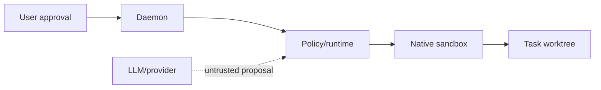

# Threat model

## Assets and trust boundaries

This is an explanatory threat baseline; normative controls belong in OpenSpec. See [sandboxing](sandboxing.md), [credentials](credentials-and-routing.md), and [privacy](privacy-and-retention.md).

Assets include source trees, credentials, task history, authored Markdown, SQLite evidence, and Git state. The user and daemon are trusted control-plane actors. Providers, model output, generated patches, helper agents, and task commands are untrusted or bounded by policy.

## Primary threats and controls

| Threat | Baseline control |
|---|---|
| Prompt/model causes destructive action | deterministic policy, approval gates, scoped worktrees, review, evidence |
| Task escapes host | bubblewrap, Landlock, seccomp, private home/env, limits, explicit levels |
| Secret exfiltration | official credential handling, no CLI token import, denied network by default |
| Malicious dependency or task command | sandbox boundary, review, risk-based verification, explicit provider/security approvals |
| History or evidence is rewritten | append-only SQLite and daemon ownership |
| Unsafe learned behavior activates | propose/evaluate/approve/activate/rollback lifecycle |
| Client bypasses authority | daemon-owned integration and deterministic state transitions |

Residual risk includes kernel/runtime vulnerabilities, host compromise, malicious approved inputs, and incorrect user acceptance. These are not solved by documentation and require implementation-specific review.
